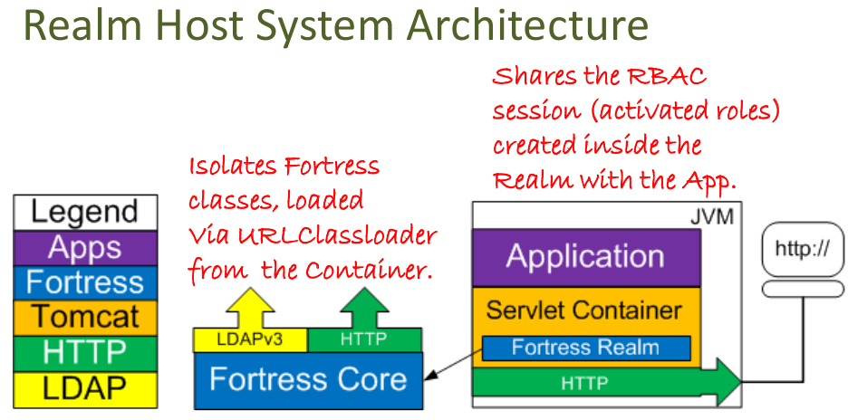

   Licensed to the Apache Software Foundation (ASF) under one
   or more contributor license agreements.  See the NOTICE file
   distributed with this work for additional information
   regarding copyright ownership.  The ASF licenses this file
   to you under the Apache License, Version 2.0 (the
   "License"); you may not use this file except in compliance
   with the License.  You may obtain a copy of the License at

     http://www.apache.org/licenses/LICENSE-2.0

   Unless required by applicable law or agreed to in writing,
   software distributed under the License is distributed on an
   "AS IS" BASIS, WITHOUT WARRANTIES OR CONDITIONS OF ANY
   KIND, either express or implied.  See the License for the
   specific language governing permissions and limitations
   under the License.

# README for Apache Fortress Realm
 * Version 2.0.8

-------------------------------------------------------------------------------
## Table of Contents

 * Document Overview
 * About Apache Fortress Realm  
 * Tips for first-time users
 * SECTION 1. Prerequisites
 * SECTION 2. Download & Install
 * SECTION 3. Instructions for Application Usage

___________________________________________________________________________________
## Document Overview

This document contains instructions to download and install the Apache Fortress Realm.  SECTION 3 contains steps to get it working with Apache Tomcat.

___________________________________________________________________________________
## About Apache Fortress Realm

* Role-Based Access Control security provider to Apache Tomcat.

* Uses Apache Tomcat Realm Interface

* Declarative controls for authentication & coarse-grained authorization (role check) 
___________________________________________________________________________________
##  Tips for first-time users

 * To use with ApacheDS: **README-QUICKSTART-APACHEDS.md** in **FORTRESS_CORE_HOME** package
 * To use OpenLDAP: **README-QUICKSTART-SLAPD.md** in **FORTRESS_CORE_HOME** package.
 * Tutorial to integrate a Java Web app with Fortress RBAC apis: [README-ENABLE-FORTRESS](https://github.com/shawnmckinney/wicket-sample/blob/master/README-ENABLE-FORTRESS.md).
 * Questions about this software package should be directed to its mailing list:
   * http://mail-archives.apache.org/mod_mbox/directory-fortress/

-------------------------------------------------------------------------------
## SECTION 1. Prerequisites

Minimum software requirements (to build):
 * git
 * Java SDK >= 11
 * Apache Maven >= 3

-------------------------------------------------------------------------------
## SECTION 2. Download & Install

1. Download the source.

 a. from git:
 ```
 git clone --branch 2.0.8 https://gitbox.apache.org/repos/asf/directory-fortress-realm.git
 cd directory-fortress-realm
 ```

 b. or download package:

 ```
 wget http://www.apache.org/dist/directory/fortress/dist/2.0.8/fortress-realm-2.0.8-source-release.zip
 unzip fortress-realm-2.0.8-source-release.zip
 cd fortress-realm-2.0.8
 ```

2. Build the source

 ```
 mvn clean install
 ```

3. Now build the javadoc:

 ```
 mvn javadoc:javadoc
 ```

 If using java 8, add this param to the pom.xml:
 ```
 <plugin>
    ...
    <artifactId>maven-javadoc-plugin</artifactId>
    <configuration>
        <additionalparam>-Xdoclint:none</additionalparam>
        ...
    </configuration>
 </plugin>
 ```

4. View the generated document here: [./target/site/apidocs/overview-summary.html](./target/site/apidocs/overview-summary.html).

-------------------------------------------------------------------------------
## SECTION 3. Instructions for Application Usage

 There are two options for web app usage of the fortress realm:

 * **Option 1** requires web apps to be dependent on the fortress realm libs but enables usage of the fortress RBAC programmatic authZ apis.
 It allows multiple realms, each of a different type and version, to be enabled within a single Tomcat instance.

 * **Option 2** frees the web app from entanglement with fortress libs, which is easier to manage, but doesn't allow fortress api usage.  It limits to a single realm instance,
  enabled globally, which might not agree with multitenant requirements.

### Table of Options

|Realm Type|Is Global Security?|Is Declarative?|Is RBAC APIs?|Multiple Realms Supported?|Fortress Dependencies?|
|:--------:|:-----------------:|:-------------:|:-----------:|:------------------------:|:--------------------:|
| Option 1 |       No          |      Yes      |     Yes     |          Yes             |         Yes          |
| Option 2 |       Yes         |      Yes      |     No      |          No              |         No           |

### Option 1. For Single Web Context
 *enable Java EE security for a single web app running under Tomcat*
 * Follow these instructions: [REALM-CONTEXT-SETUP](./REALM-CONTEXT-SETUP.md).

 

-------------------------------------------------------------------------------

### Option 2. For Global Security
 *enable Java EE security for all web apps running under Tomcat*
 * Follow these instructions: [REALM-HOST-SETUP](./REALM-HOST-SETUP.md).

  

___________________________________________________________________________________
#### END OF README
