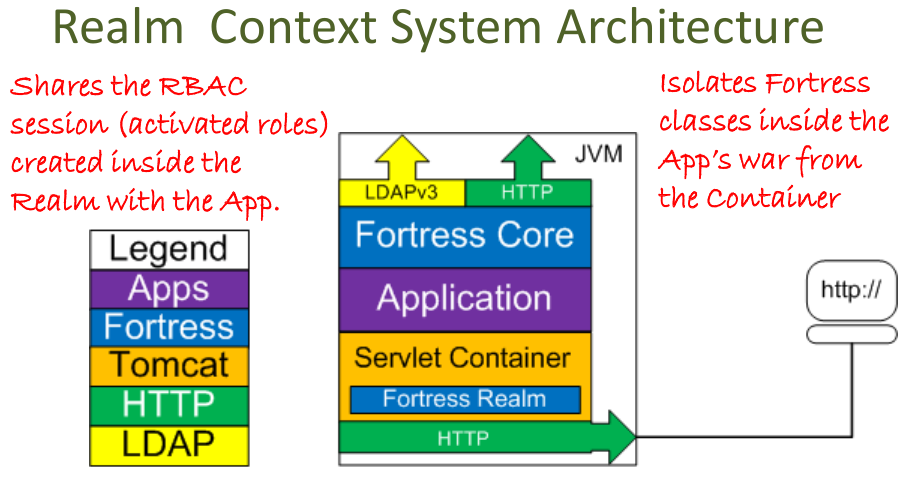

   Licensed to the Apache Software Foundation (ASF) under one
   or more contributor license agreements.  See the NOTICE file
   distributed with this work for additional information
   regarding copyright ownership.  The ASF licenses this file
   to you under the Apache License, Version 2.0 (the
   "License"); you may not use this file except in compliance
   with the License.  You may obtain a copy of the License at

     http://www.apache.org/licenses/LICENSE-2.0

   Unless required by applicable law or agreed to in writing,
   software distributed under the License is distributed on an
   "AS IS" BASIS, WITHOUT WARRANTIES OR CONDITIONS OF ANY
   KIND, either express or implied.  See the License for the
   specific language governing permissions and limitations
   under the License.

# README for Apache Fortress Realm Context Setup
 * Version 2.0.7
 * Apache Fortress Realm Context System Architecture Diagram
 

-------------------------------------------------------------------------------
## Table of Contents

 * Document Overview
 * Tips for first-time users.
 * SECTION 1. Prerequisites.
 * SECTION 2. Prepare Tomcat for the Context Realm.
 * SECTION 3. Enable Web App to use the Context Realm.
 * More on the Realm Proxy

___________________________________________________________________________________
## Document Overview

This document contains instructions to enable Apache Fortress Realm for a single Web app context running under Apache Tomcat.  To enable for all apps running, using Tomcat global security option, follow these steps [REALM-HOST-SETUP](./REALM-HOST-SETUP.md) instead.

___________________________________________________________________________________
##  Tips for first-time users

 * For a tutorial on how to use Apache Fortress check out the quickstarts in directory-fortress-core package.
 * For a tutorial on how to enable a Web application to use Fortress, check out the: [README-ENABLE-FORTRESS](https://github.com/shawnmckinney/wicket-sample/blob/master/README-ENABLE-FORTRESS.md).
 * If you see **FORTRESS_CORE_HOME**, refer to the base package of [directory-fortress-core].
 * If you see **FORTRESS_REALM_HOME**, refer to this packages base folder.
 * If you see **TOMCAT_HOME**, refer to the location of that package's base folder.
 * Questions about this software package should be directed to its mailing list:
   * http://mail-archives.apache.org/mod_mbox/directory-fortress/

-------------------------------------------------------------------------------
## SECTION 1. Prerequisites

Minimum hardware requirements:
 * 2 Cores
 * 4GB RAM

Minimum software requirements:
 * Java SDK 8++
 * Apache Tomcat7++
 * git
 * Apache Maven3++
 * Apache Fortress Core **Download & Install** in **FORTRESS_CORE_HOME** package **README.md**.
 * Apache Fortress Core **Options for using Apache Fortress and LDAP server** in **FORTRESS_CORE_HOME** package **README.md**.
 * Apache Fortress Realm **Download & Install** in this package's [README](README.md).

Everything else covered in steps that follow.  Tested on Debian, Centos & Windows machines.

-------------------------------------------------------------------------------
## SECTION 2. Prepare Tomcat for the Context Realm

1. copy **FORTRESS_REALM_HOME** proxy jar to **TOMCAT_HOME**/lib/

 ```
 cp $FORTRESS_REALM_HOME/proxy/target/fortress-realm-proxy-[version].jar $TOMCAT_HOME/lib
 ```

2. Restart Tomcat server for changes to take effect.

-------------------------------------------------------------------------------
## SECTION 3. Enable Web App to use the Context Realm

1. Add a **context.xml** file to the **META-INF** folder of target web app.
 ```
 vi $MY_APP_HOME/src/main/resources/META-INF/conf/context.xml
 ```

2. Add to the file:
 ```
 <Context path="/myappcontext" reloadable="true">
    <Realm className="org.apache.directory.fortress.realm.tomcat.Tc7AccessMgrProxy"
           debug="0"
           resourceName="UserDatabase"
           defaultRoles=""
           containerType="TomcatContext"
           realmClasspath=""
           contextId="HOME"
            />
 </Context>
 ```

 Where *myappcontext* is the web context for *your* web application.

3. Edit the web app's deployment descriptor:
 ```
 vi $MY_APP_HOME/src/main/webapp/WEB-INF/web.xml
 ```

4. Add Java EE security constraint declarations to the file:
 ```
  ...
  <security-constraint>
      <display-name>Commander Security Constraint</display-name>
      <web-resource-collection>
          <web-resource-name>Protected Area</web-resource-name>
          <!-- Define the context-relative URL(s) to be protected -->
          <url-pattern>/*</url-pattern>
      </web-resource-collection>
      <auth-constraint>
          <!-- Anyone with one of the listed roles may access this area -->
          <role-name>MY_ROLE_NAME</role-name>
          ...
      </auth-constraint>
  </security-constraint>

  <!-- Example of HTTP Basic Authentication Setup. -->
  <login-config>
      <auth-method>BASIC</auth-method>
      <realm-name>FortressSecurityRealm</realm-name>
  </login-config>

  <!-- Security roles referenced by this web application -->
  <security-role>
      <role-name>MY_ROLE_NAME</role-name>
  </security-role>
  ...
 ```

 *Fortress Realm follows standard Java EE security semantics.*

5. Add this dependency to the Web app's **pom.xml** file.

 ```
 <dependency>
     <groupId>org.apache.directory</groupId>
     <artifactId>fortress-realm-impl</artifactId>
     <version>${project.version}</version>
     <classifier>classes</classifier>
  </dependency>
  ```

 *Where project.version contains target version, e.g. 1.0-RC41*

6. Add the **fortress.properties** file to the classpath of the web app.

 Copy the fortress.properties, created during **FORTRESS_CORE_HOME** setup, to app resource folder.
 ```
 cp $FORTRESS_CORE_HOME/config/fortress.properties $MY_APP_HOME/src/main/resources
 ```

7. Verify a match for target LDAP server coordinates.
 ```
 # This param tells fortress what type of ldap server in use:
 ldap.server.type=apacheds

 # ldap host name
 host=localhost

 # if ApacheDS is listening on
 port=10389

 # If ApacheDS, these credentials are used for read/write to fortress DIT
 admin.user=uid=admin,ou=system
 admin.pw=secret

 # This is min/max settings for admin pool connections:
 min.admin.conn=1
 max.admin.conn=10

 # This node contains more fortress properties stored on behalf of connecting LDAP clients:
 config.realm=DEFAULT
 config.root=ou=Config,dc=example,dc=com

 # Used by application security components:
 perms.cached=true

 # Fortress uses a cache:
 ehcache.config.file=ehcache.xml

 # Default for pool reconnect flag is false:
 enable.pool.reconnect=true
 ```

8. Add two other files, **ehcache.xml** and **log4j.properties** to classpath of the web app.

 ```
 cp $FORTRESS_REALM_HOME/conf/echcache.xml $MY_APP_HOME/src/main/resources
 cp $FORTRESS_REALM_HOME/conf/log4j.properties $MY_APP_HOME/src/main/resources
 ```

9. Verify these configuration artifacts are properly staged to your app resource folder:
 ```
 x@machine:~/MY_APP_HOME/src/main/resources$ ls -l
 ...
 -rwxrwxr-x 1 x y 5905 Jan 23 12:41 ehcache.xml
 -rw-rw-r-- 1 x y 1161 Jan 23 12:41 fortress.properties
 -rw-rw-r-- 1 x y 1235 Jan 23 12:41 log4j.properties
 ...
 ```
 *Fortress needs all three files in its classpath.*

10. Redeploy web application to Tomcat.

11. Login to the web app.  Users that successfully authenticate and have role(s) listed in **auth-constraint** of web deployment descriptor may access matching resources under the **url-pattern**.

12. Verify that realm is operating properly per Tomcat server log:

 ```
 tail -f -n10000 $TOMCAT_HOME/logs/catalina.out
 ...
 org.apache.directory.fortress.realm.tomcat.Tc7AccessMgrProxy J2EE Tomcat7 policy agent initialization successful
 ...
 ```

Realm Usage Notes:
* This automatically enforces authentication and coarse-gained authorization (isUserInRole) checking for a single web app.
* Repeat steps in this section for each additional app using the Fortress Realm.

## More on the Realm Proxy
The fortress realm proxy jar contains a *shim* that uses a URLClassLoader to reach its implementation libs. It prevents the realm impl libs, pulled in as dependency to your web app, from interfering with Tomcat's system classpath thus providing an error free deployment process w/out classloader issues. This satisfies requirements related to web hosting and multitenancy.

___________________________________________________________________________________
#### END OF README-CONTEXT-SETUP.md
